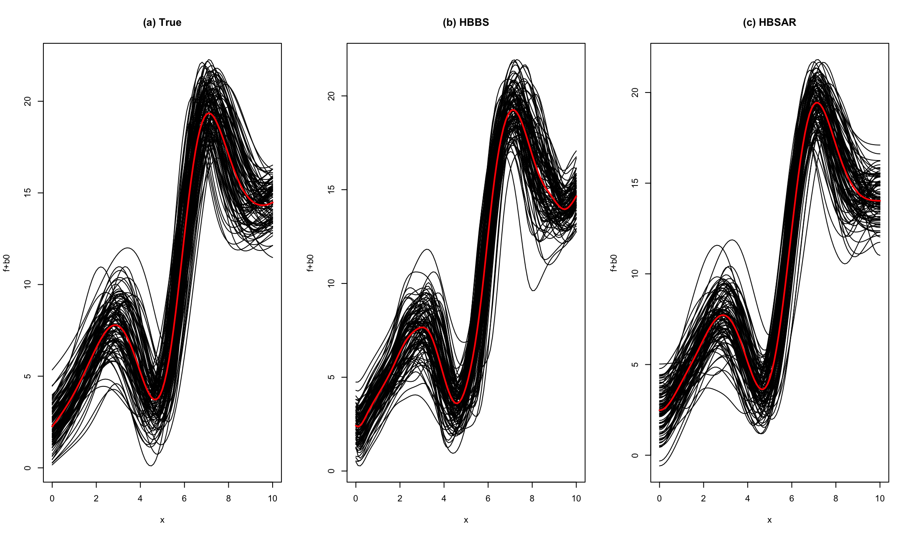
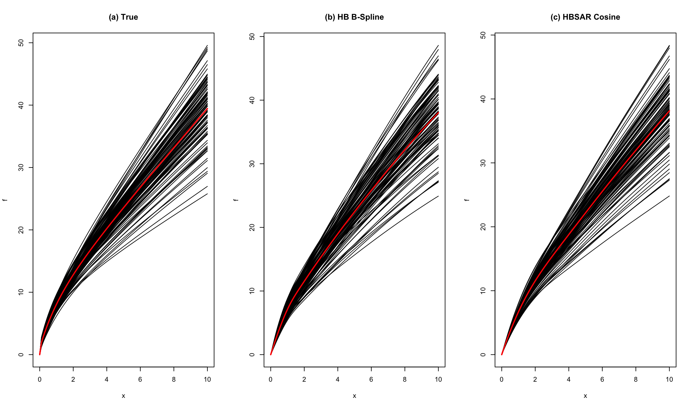
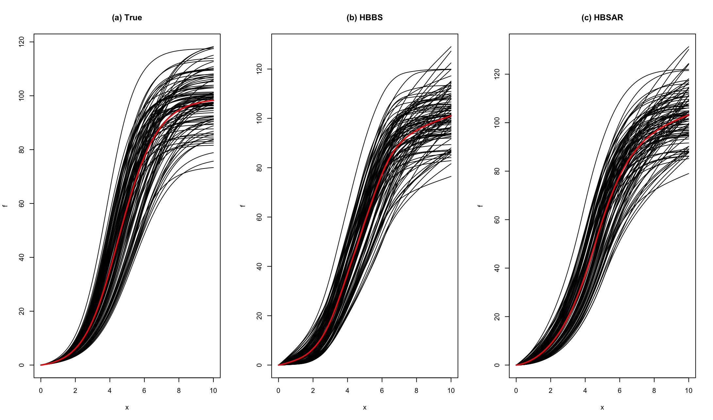
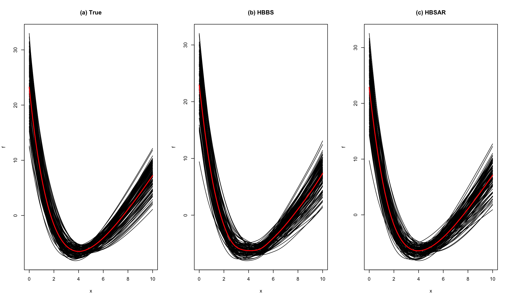
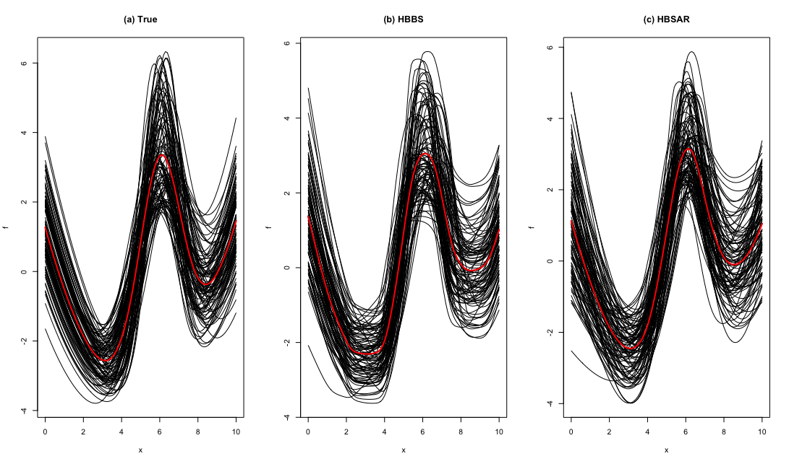

# HBSARSCdev v0.2.1
Hierarchical Bayesian Spectral Regression with Shape Constraints for Multi-Group Data
## Authors
Peter Lenk, University of Michigan (plenk@umich.edu) <br/>
Jangwon Lee, Korea University (jangwonlee@korea.ac.kr) <br/>
Dongu Han, Korea University (idontknow35@korea.ac.kr) <br/>
Jichan Park, Korea University (2020020343@korea.ac.kr) <br/>
Taeryon Choi, Korea University  (trchoi@korea.ac.kr) <br/>
## Maintainers
Jangwon Lee, Korea University (jangwonlee@korea.ac.kr)
Dongu Han, Korea University (idontknow35@korea.ac.kr)
Jichan Park, Korea University (2020020343@korea.ac.kr)
# Introduction
We propose a hierarchical Bayes (HB) model for functional data analysis where different groups have different flexible regression functions. We use HB Gaussian processes to model the functions at the lower-level (within groups) and upper-level (between groups). The spectral coefficients of the Gaussian processes have HB smoothing priors that serve two roles: they describe the heterogeneity in the spectral coefficients across groups, and they determine the smoothness of the flexible functions. The HB model is particularly appropriate when data within groups are sparse or do not cover the entire domain of the function. In these cases, the HB Gaussian model pools data across groups and relies on the upper-level model for estimation. Our model also allows shape constraints, such as monotonic functions. When appropriate, shape constraints drastically improve estimation with sparse data. 
# Simulation examples with various shape constraint functions.
We generate a simulation dataset from the following equation:
```math
y_{ij}  =  \mathbf{v}_{i,j}' \boldsymbol{\alpha} + \mathbf{w}_{i,j}'\boldsymbol{\beta}_j  + f_j(x_{i,j}) + \epsilon_{i,j}~\mbox{ for }~ i = 1, \ldots, 20 \mbox{ and } j = 1, \ldots, 100.
```
 - $\alpha=1$ and $\boldsymbol{\beta}\sim N(\boldsymbol{\mu},\Lambda)$, where $\boldsymbol{\mu}=(10,2)'$ and $\Lambda$ is a $2\times 2$ diagonal matrix with elements $0.5+0.25\text{Unif}(0,1)$.  
 - $`\mathbf{v}_{i,j} = v_{i,j}`$ and $`\mathbf{w}_{i,j} = (1,w_{i,j})'`$ were generated from $N(0,1)$.

## Unconstrained functions
```r
xmin=0 
xmax=10
iflagCenter  = 1
iflagZ       = 0
iflagHBsigma = 1

nbasis=nknots=20
mcmc=list(nblow=50000,smcmc=10000)
shape = "Free"
set.seed(1)
fout_HBSAR = HBSAR(ydata=ydata, xdata=xdata, vdata=vdata, wdata=wdata[,-1,drop=F], 
                   zdata=NULL, id_group=id_group, nbasis=nbasis, xmin=xmin, xmax=xmax, mcmc=mcmc,
                   iflagHBsigma=iflagHBsigma, shape=shape)

set.seed(1)
fout_HBBS  = HBBS(ydata=ydata, xdata=xdata, vdata=vdata, wdata=wdata[,-1,drop=F], 
                  zdata=NULL, id_group=id_group, nknots=nknots, xmin=xmin, xmax=xmax, mcmc=mcmc,
                  iflagZ=iflagZ, iflagHBsigma=iflagHBsigma, iflagACE=iflagACE, 
                  iflagHBsigma=iflagHBsigma, shape=shape)

par(mfrow=c(1,3))
f0t = phit[1] + f0xgridt
fjt = matrix(betat[,1],length(xgrid),ngroups,byrow=T)+fxgridt
plot(xgrid, f0t, type="l", col="red", lwd=2, xlab="x", ylab="f+b0", main="(a) True",
     ylim = range(c(f0t,fjt)))
for (j in 1:ngroups) {
  lines(xgrid, fjt[,j])
}
lines(xgrid, f0t, col="red", lwd=2)

f0_HBBS = fout_HBBS$post.est$phim[1]+fout_HBBS$post.est$f0xgridm
fj_HBBS = matrix(fout_HBBS$post.est$betam[,1],length(xgrid),ngroups,byrow=T)+fout_HBBS$post.est$fxgridm
plot(xgrid, f0_HBBS, type="l", col="red", lwd=2, xlab="x", ylab="f+b0", main="(b) HBBS",
     ylim = range(c(f0_HBBS,fj_HBBS)))
for (j in 1:ngroups) {
  lines(xgrid, fj_HBBS[,j])
}
lines(xgrid, f0_HBBS, col="red", lwd=2)

f0_HBSAR = fout_HBSAR$post.est$phim[1]+fout_HBSAR$post.est$f0xgridm
fj_HBSAR = matrix(fout_HBSAR$post.est$betam[,1],length(xgrid),ngroups,byrow=T)+fout_HBSAR$post.est$fxgridm
plot(xgrid, f0_HBSAR, type="l", col="red", lwd=2, xlab="x", ylab="f+b0", main="(c) HBSAR",
     ylim = range(c(f0_HBSAR,fj_HBSAR)))
for (j in 1:ngroups) {
  lines(xgrid, fj_HBSAR[,j])
}
lines(xgrid, f0_HBSAR, col="red", lwd=2)
```


## Concave, monotone functions.
```r
xmin=0 
xmax=10
iflagCenter  = 0
iflagZ       = 0
iflagHBsigma = 1

nbasis=nknots=20
mcmc=list(nblow=40000,smcmc=10000)
shape = "IncreasingConcave"

set.seed(1);
fout_HBBS  = HBBS(ydata=ydata, xdata=xdata, vdata=vdata, wdata=wdata[,-1,drop=F], 
                          zdata=NULL, id_group=id_group, nknots=nknots,
                          xmin=xmin, xmax=xmax, mcmc=mcmc, iflagCenter=iflagCenter,
                          iflagZ=iflagZ, iflagHBsigma=iflagHBsigma, shape=shape)

set.seed(1); 
fout_HBSAR = HBSAR(ydata=ydata, xdata=xdata, vdata=vdata, wdata=wdata[,-1,drop=F], 
                           zdata=NULL, id_group=id_group, nbasis=nbasis,
                           xmin=xmin, xmax=xmax, mcmc=mcmc, iflagCenter=iflagCenter,
                           iflagZ=iflagZ, iflagHBsigma=iflagHBsigma, shape=shape)

par(mfrow=c(1,3))
f0t = f0xgridt
fjt = fxgridt
plot(xgrid, f0t, type="l", col="red", lwd=2, xlab="x", ylab="f", main="(a) True",
     ylim = range(c(f0t,fjt)))
for (j in 1:ngroups) {
  lines(xgrid, fjt[,j])
}
lines(xgrid, f0t, col="red", lwd=2)

fig_fall(fout_HBBS,"(b) HB B-Spline")
fig_fall(fout_HBSAR,"(c) HBSAR Cosine")
```


## S-shaped functions.
```r
xmin=0 
xmax=10
iflagCenter  = 0
iflagZ       = 0
iflagHBsigma = 1
iflagpsi     = 1

nbasis=nknots=20
mcmc=list(nblow=40000,smcmc=10000)
shape = "IncreasingS"

set.seed(1);
fout_HBBS  = HBBS(ydata=ydata, xdata=xdata, vdata=vdata, wdata=wdata[,-1,drop=F], 
                  zdata=NULL, id_group=id_group, nknots=nknots,
                  xmin=xmin, xmax=xmax, mcmc=mcmc, iflagCenter=iflagCenter,
                  iflagZ=iflagZ, iflagHBsigma=iflagHBsigma, shape=shape)

set.seed(1); 
fout_HBSAR = HBSAR(ydata=ydata, xdata=xdata, vdata=vdata, wdata=wdata[,-1,drop=F], 
                   zdata=NULL, id_group=id_group, nbasis=nbasis,
                   xmin=xmin, xmax=xmax, mcmc=mcmc, iflagCenter=iflagCenter,
                   iflagZ=iflagZ, iflagHBsigma=iflagHBsigma, shape=shape)

par(mfrow=c(1,3))
f0t = f0xgridt
fjt = fxgridt
plot(xgrid, f0t, type="l", col="red", lwd=2, xlab="x", ylab="f", main="(a) True",
     ylim = range(c(f0t,fjt)))
for (j in 1:ngroups) {
  lines(xgrid, fjt[,j])
}
lines(xgrid, f0t, col="red", lwd=2)

fig_fall(fout_HBBS,"(b) HBBS")
fig_fall(fout_HBSAR,"(c) HBSAR")
```


## U-shaped functions.
```r
xmin=0 
xmax=10

iflagCenter  = 1
iflagZ       = 0
iflagHBsigma = 1
iflagpsi     = 1

nbasis=nknots=20
mcmc=list(nblow=40000,smcmc=10000)
shape = "Ushape"


set.seed(1);
fout_HBBS  = HBBS(ydata=ydata, xdata=xdata, vdata=vdata, wdata=wdata[,-1,drop=F], 
                  zdata=NULL, id_group=id_group, nknots=nknots, 
                  xmin=xmin, xmax=xmax, mcmc=mcmc, iflagCenter=iflagCenter,
                  iflagZ=iflagZ, iflagHBsigma=iflagHBsigma, nExtreme=1, shape=shape)

set.seed(1); 
fout_HBSAR = HBSAR(ydata=ydata, xdata=xdata, vdata=vdata, wdata=wdata[,-1,drop=F], 
                   zdata=NULL, id_group=id_group, nbasis=nbasis,
                   xmin=xmin, xmax=xmax, mcmc=mcmc, iflagCenter=iflagCenter,
                   iflagZ=iflagZ, iflagHBsigma=iflagHBsigma, nExtreme=1, shape=shape)

par(mfrow=c(1,3))
f0t = f0xgridt
fjt = fxgridt
plot(xgrid, f0t, type="l", col="red", lwd=2, xlab="x", ylab="f", main="(a) True",
     ylim = range(c(f0t,fjt)))
for (j in 1:ngroups) {
  lines(xgrid, fjt[,j])
}
lines(xgrid, f0t, col="red", lwd=2)

fig_fall(fout_HBBS,"(b) HBBS")
fig_fall(fout_HBSAR,"(c) HBSAR")
```


## Multi-modal functions.
```r
xmin=0 
xmax=10

iflagCenter  = 1
iflagZ       = 0
iflagHBsigma = 1
iflagpsi     = 1

nbasis=nknots=20
mcmc=list(nblow=100000,smcmc=10000)
shape = "DecMultiModal"


set.seed(1);
fout_HBBS  = HBBS(ydata=ydata, xdata=xdata, vdata=vdata, wdata=wdata[,-1,drop=F], 
                  zdata=NULL, id_group=id_group, nknots=nknots, 
                  xmin=xmin, xmax=xmax, mcmc=mcmc, iflagCenter=iflagCenter,
                  iflagZ=iflagZ, iflagHBsigma=iflagHBsigma, nExtreme=3, shape=shape)

set.seed(1); 
fout_HBSAR = HBSAR(ydata=ydata, xdata=xdata, vdata=vdata, wdata=wdata[,-1,drop=F], 
                   zdata=NULL, id_group=id_group, nbasis=nbasis,
                   xmin=xmin, xmax=xmax, mcmc=mcmc, iflagCenter=iflagCenter,
                   iflagZ=iflagZ, iflagHBsigma=iflagHBsigma, nExtreme=3, shape=shape)

par(mfrow=c(1,3))
f0t = f0xgridt
fjt = fxgridt
plot(xgrid, f0t, type="l", col="red", lwd=2, xlab="x", ylab="f", main="(a) True",
     ylim = range(c(f0t,fjt)))
for (j in 1:ngroups) {
  lines(xgrid, fjt[,j])
}
lines(xgrid, f0t, col="red", lwd=2)

fig_fall(fout_HBBS,"(b) HBBS")
fig_fall(fout_HBSAR,"(c) HBSAR")
```

